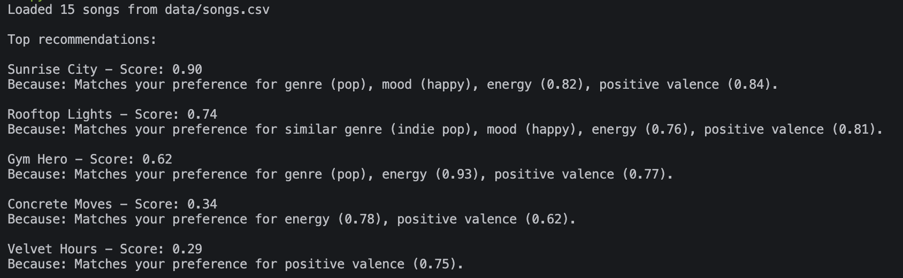
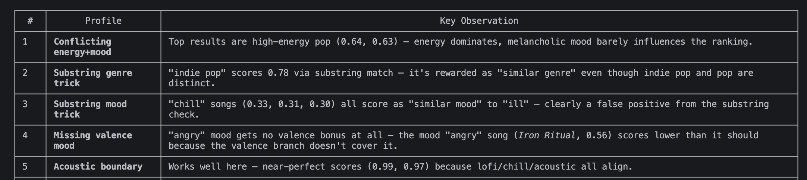

# 🎵 Music Recommender Simulation

## Project Summary

In this project you will build and explain a small music recommender system.

Your goal is to:

- Represent songs and a user "taste profile" as data
- Design a scoring rule that turns that data into recommendations
- Evaluate what your system gets right and wrong
- Reflect on how this mirrors real world AI recommenders

VibeMatch 1.0 scores every song in a 15-song catalog against a user's genre, mood, energy, and acoustic preferences, then returns the top 5 matches. Scoring is a weighted sum: genre match is worth the most (0.30), followed by mood (0.25), energy closeness (0.25), acoustic preference (0.10), and a valence bonus for emotionally aligned songs (0.10). If a preference is not set, that component is skipped and the remaining weights still apply.

---

## How The System Works

Each `Song` stores: `title`, `artist`, `genre`, `mood`, `energy` (0–1), `tempo_bpm`, `valence` (0–1, how positive the song feels), `danceability` (0–1), and `acousticness` (0–1).

The `UserProfile` stores four preferences:
- `favorite_genre` — e.g. `"pop"` or `"lofi"`
- `favorite_mood` — e.g. `"happy"` or `"chill"`
- `target_energy` — a float like `0.8` for high-energy or `0.3` for mellow
- `likes_acoustic` — `True` or `False`

The `Recommender` calls `score_song()` on every song and returns the top `k` by score. Scoring works as a weighted sum:

| Feature | Rule | Max weight |
|---|---|---|
| Genre | Exact match = 0.30; partial substring = 0.15 | 0.30 |
| Mood | Exact match = 0.25; partial substring = 0.10 | 0.25 |
| Energy | `0.25 × (1 − |user_energy − song_energy|)` | 0.25 |
| Acousticness | Preference direction matches song level | 0.10 |
| Valence bonus | Positive moods reward high valence; chill/melancholic reward low valence | 0.10 |

Songs are ranked by score descending and the top 5 are returned.

---

## Getting Started

### Setup

1. Create a virtual environment (optional but recommended):

   ```bash
   python -m venv .venv
   source .venv/bin/activate      # Mac or Linux
   .venv\Scripts\activate         # Windows

2. Install dependencies

```bash
pip install -r requirements.txt
```

3. Run the app:

```bash
python -m src.main
```

### Running Tests

Run the starter tests with:

```bash
pytest
```

You can add more tests in `tests/test_recommender.py`.

---

## Experiments You Tried

- **Conflicting preferences (high energy + sad mood):** Genre and energy dominated the score, so the sad-mood preference was often overridden. The top results were energetic songs that didn't match the intended vibe.
- **Substring genre trick:** Setting genre to `"pop"` matched `"indie pop"` via partial matching, giving unintended score boosts. This revealed the substring comparison is too loose.
- **Substring mood trick:** Setting mood to `"ill"` matched `"chill"` songs — a false positive that proved edge-case testing matters.
- **Valence bonus gap:** Moods like `"angry"` and `"excited"` don't qualify for the valence bonus, silently disadvantaging users with those preferences.
- **Weight shift experiment (genre halved to 0.15, energy doubled to 0.50):** Helped the angry metal profile but hurt users whose genre preference was the strongest signal — making results different, not uniformly better.
- **Energy = 0.5 (center):** Almost no change in rankings because every song is within 0.5 of center; this exposed that a centered energy preference has almost no discriminating power.

---

## Limitations and Risks

- The 15-song catalog is tiny — users who prefer jazz or country always see the same single song regardless of energy or mood preferences.
- Substring genre and mood matching causes false positives (e.g. `"ill"` matches `"chill"`).
- The system assumes one genre, one mood, and one energy level per user — it can't handle mixed tastes or context (working out vs. studying).
- Some moods (`"angry"`, `"excited"`) are excluded from the valence bonus, silently giving them lower scores.
- It has no memory — every session starts fresh with no history of what the user has already heard or rated.
- Energy = 0.5 is nearly useless as a signal because it's equidistant from every song in the catalog.

---

## Reflection

Read and complete `model_card.md`:

[**Model Card**](model_card.md)

Building this showed me that a scoring-based recommender feels surprisingly intelligent even when the logic is just arithmetic. Assigning weights to genre, mood, and energy produces rankings that seem reasonable — until you probe edge cases. The substring mood bug ("ill" matching "chill") was the clearest example: the code looked correct at a glance, but it rewarded the wrong songs. That taught me that correctness in a recommender isn't just about the math working — it's about whether the assumptions behind each comparison actually hold.

The bias angle was less obvious but more important. The system implicitly favors high-energy, pop-adjacent users because the catalog has more songs in that space and the valence bonus only rewards a subset of moods. Users who like metal, jazz, or folk get structurally worse recommendations not because the weights are wrong, but because the data was never balanced in the first place. That mirrors how real recommenders inherit the biases of whoever curated the training data — fairness problems often hide in the dataset, not the algorithm.


---

## 7. `model_card_template.md`

Combines reflection and model card framing from the Module 3 guidance. :contentReference[oaicite:2]{index=2}  

```markdown
# 🎧 Model Card - Music Recommender Simulation

## 1. Model Name

Give your recommender a name, for example:

> VibeFinder 1.0

---

## 2. Intended Use

- What is this system trying to do
- Who is it for

Example:

> This model suggests 3 to 5 songs from a small catalog based on a user's preferred genre, mood, and energy level. It is for classroom exploration only, not for real users.

---

## 3. How It Works (Short Explanation)

Describe your scoring logic in plain language.

- What features of each song does it consider
- What information about the user does it use
- How does it turn those into a number

This music recommender will use the energy of a song, acousticness, genre, and mood.

ascore = e^(-(song_value - user_preference)² / (2σ²))
  Where σ (sigma) controls the "tolerance width":
  - Small σ (e.g. 0.1) = strict, only very close songs score high
  - Large σ (e.g. 0.3) = lenient, similar songs still score reasonably
  well


  ┌───────────┬─────────────┬───────┬───────┬───────┐
  │ User pref │ Song energy │ σ=0.1 │ σ=0.2 │ σ=0.3 │
  ├───────────┼─────────────┼───────┼───────┼───────┤
  │ 0.8       │ 0.82        │ 0.98  │ 0.99  │ 1.00  │
  ├───────────┼─────────────┼───────┼───────┼───────┤
  │ 0.8       │ 0.60        │ 0.14  │ 0.61  │ 0.80  │
  ├───────────┼─────────────┼───────┼───────┼───────┤
  │ 0.8       │ 0.30        │ ~0.00 │ 0.04  │ 0.25  │
  └───────────┴─────────────┴───────┴───────┴───────┘

  For genre and mood, it's binary — either it matches or it doesn't:

  score = 1  if song_genre == user_preferred_genre
  score = 0  otherwise

    Combining Into a Final Score

  Weighted sum across all features:

  final_score = (w_energy     × energy_score)
              + (w_acousticness × acousticness_score)
              + (w_genre      × genre_score)
              + (w_mood       × mood_score)

  Where weights sum to 1.0. Suggested starting weights:

  w_energy        = 0.30
  w_acousticness  = 0.30
  w_genre         = 0.25
  w_mood          = 0.15
  ─────────────────────────
  total           = 1.00

  Energy and acousticness get more weight because they have the strongest discriminating power in the dataset.

  ⏺ ┌─────────────────────────────────────────────────────┐                 
  │                  USER TASTE PROFILE                 │                 
  │                                                     │                 
  │   energy: 0.75    acousticness: 0.25                │                 
  │   genre:  None    mood:         None                │                 
  └──────────────────────────┬──────────────────────────┘                 
                             │                                            
                      ┌──────▼──────┐                                     
                      │  songs.csv  │                                     
                      │  (15 songs) │
                      └──────┬──────┘                                     
                             │                                            
                      ┌──────▼──────────────┐
                      │ scores = []         │                             
                      │ for each song...    │                             
                      └──────┬──────────────┘
                             │                                            
            ┌────────────────▼────────────────┐
            │         SCORING BLOCK           │                           
            │                                 │
            │  mood set?  ──No──▶  skip (+0)  │                           
            │      │ Yes                      │                           
            │      ▼                          │
            │  mood match? ──▶ +35 pts        │                           
            │                                 │
            │  genre set? ──No──▶  skip (+0)  │                           
            │      │ Yes                      │                           
            │      ▼                          │
            │  genre match? ──▶ +25 pts       │                           
            │                                 │                           
            │  energy delta = |0.75 - e|      │
            │  score += (1 - delta) × 25      │                           
            │                                 │                           
            │  acoustic delta = |0.25 - a|    │
            │  score += (1 - delta) × 15      │                           
            │                                 │
            │  MAX possible = 40 pts          │                           
            │  (mood/genre skipped)           │                           
            └────────────────┬────────────────┘
                             │                                            
                      ┌──────▼──────────────┐
                      │ append (song, score)│                             
                      │ to scores list      │                             
                      └──────┬──────────────┘
                             │                                            
                      ┌──────▼──────────────┐
                      │  sort descending    │                             
                      │  slice top K        │
                      └──────┬──────────────┘                             
                             │                                            
            ┌────────────────▼────────────────┐
            │         TOP K RESULTS           │                           
            │                                 │
            │  1. Night Drive Loop   ~38/40   │
            │  2. Rooftop Lights     ~35/40   │                           
            │  3. Sunrise City       ~33/40   │
            │  ...                            │                           
            └─────────────────────────────────┘





Try to avoid code in this section, treat it like an explanation to a non programmer.

---

## 4. Data

Describe your dataset.

- How many songs are in `data/songs.csv`
- Did you add or remove any songs
- What kinds of genres or moods are represented
- Whose taste does this data mostly reflect

---

## 5. Strengths

Where does your recommender work well

You can think about:
- Situations where the top results "felt right"
- Particular user profiles it served well
- Simplicity or transparency benefits

---

## 6. Limitations and Bias

Where does your recommender struggle

Some prompts:
- Does it ignore some genres or moods
- Does it treat all users as if they have the same taste shape
- Is it biased toward high energy or one genre by default
- How could this be unfair if used in a real product

---

## 7. Evaluation

How did you check your system

Examples:
- You tried multiple user profiles and wrote down whether the results matched your expectations
- You compared your simulation to what a real app like Spotify or YouTube tends to recommend
- You wrote tests for your scoring logic

You do not need a numeric metric, but if you used one, explain what it measures.

---

## 8. Future Work

If you had more time, how would you improve this recommender

Examples:

- Add support for multiple users and "group vibe" recommendations
- Balance diversity of songs instead of always picking the closest match
- Use more features, like tempo ranges or lyric themes

---

## 9. Personal Reflection

A few sentences about what you learned:

- What surprised you about how your system behaved
- How did building this change how you think about real music recommenders
- Where do you think human judgment still matters, even if the model seems "smart"

